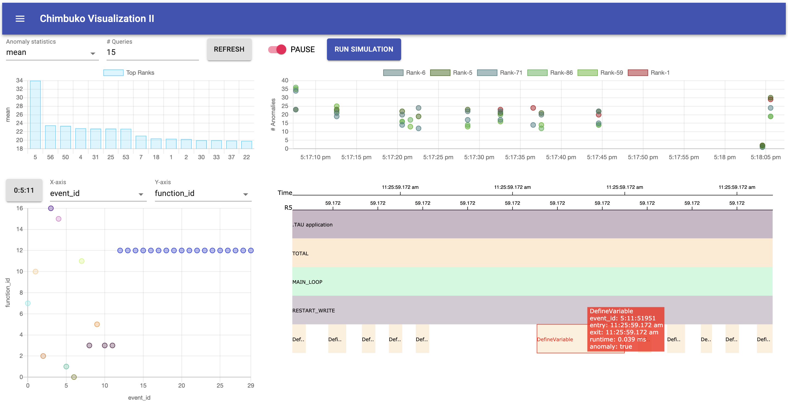

# ChimbukoVisualizationII

Scalable visualization module for Chimbuko

## Overview 

### In-situ Visualization Components
* `Top & Bottom Dynamic MPI Ranks`: visualizes the most and the least fluctuating MPI ranks simultaneously based on several statistical values, such as min, max, mean, std, skewness, kurtosis, and cumulative delta.
* `Selected Rank History`: visualizes temporal anomaly distribution of the selected MPI rank, which can be navigated from the beginning to the latest frame. 

### Online Analysis Visualization Components
* `Projection of Function Executions`: visualizes executions whitin the selected frame interval. 
* `Selected Call Stack Tree`: visualizes detailed call stack tree of the selected execution.
* `Timeline and Message Visualization`: visualizes detailed timeline of the selected execution and the message communication between the MPI ranks.
